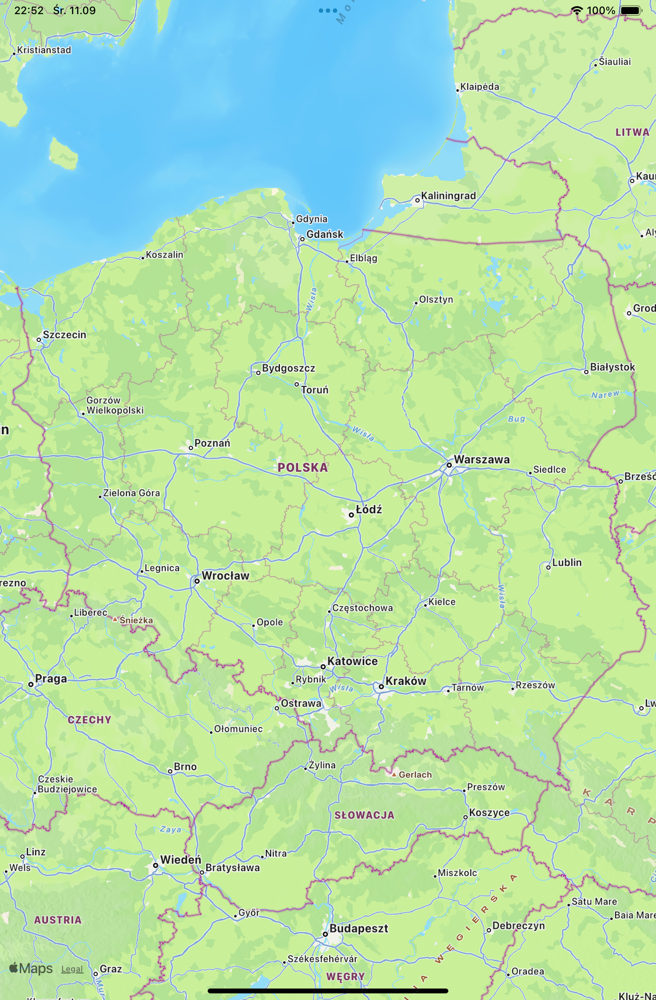
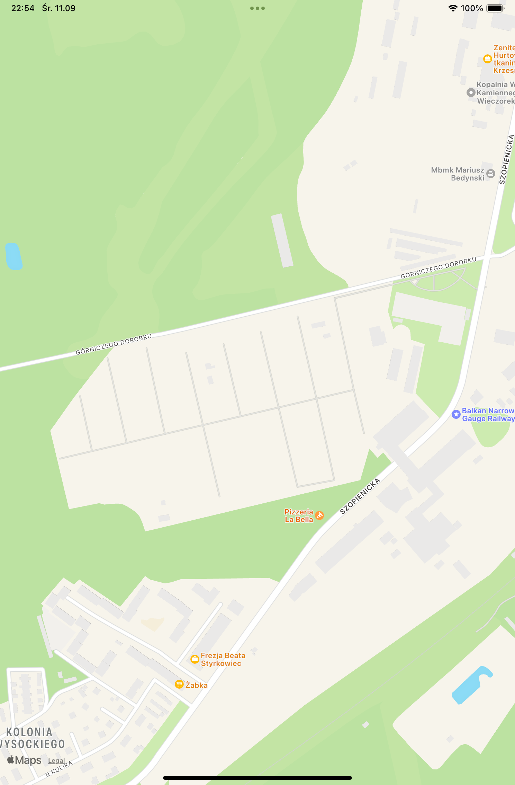
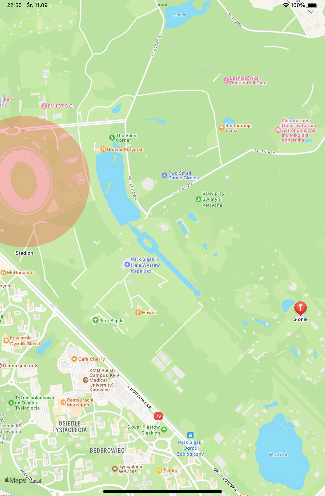
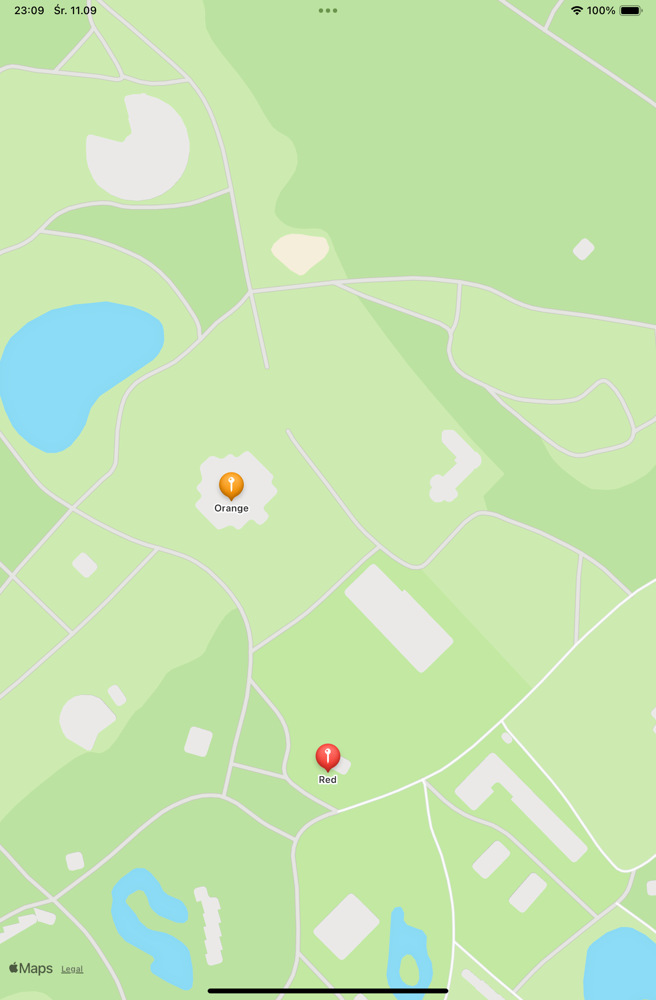
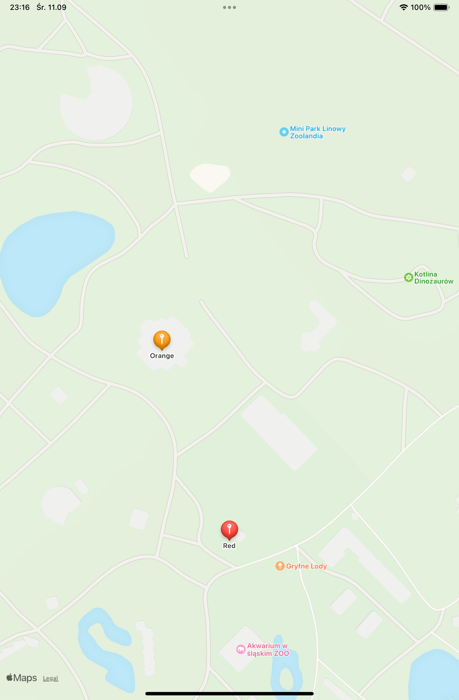
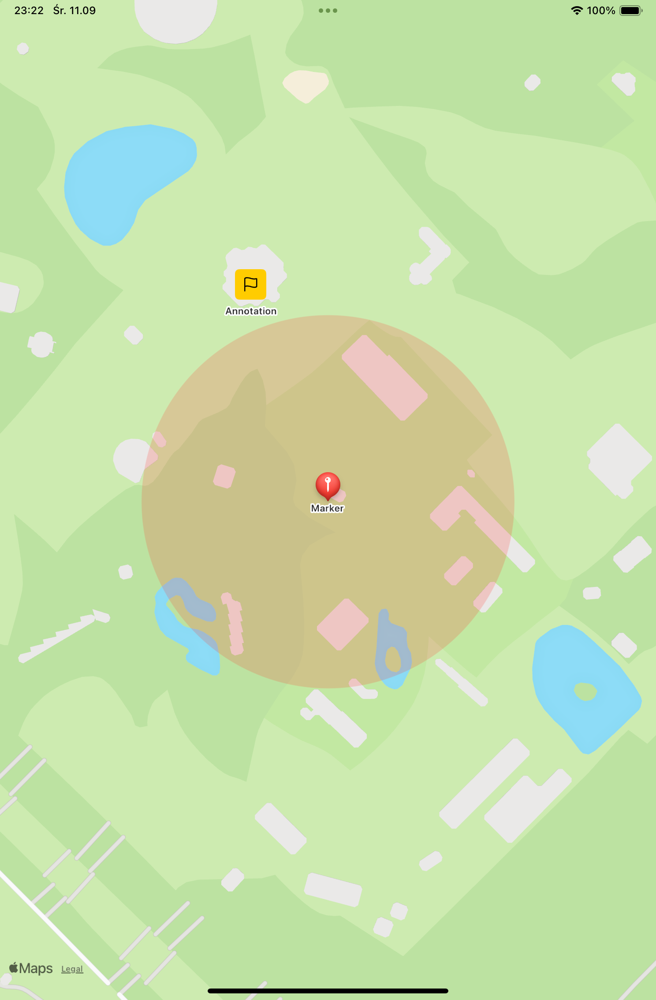
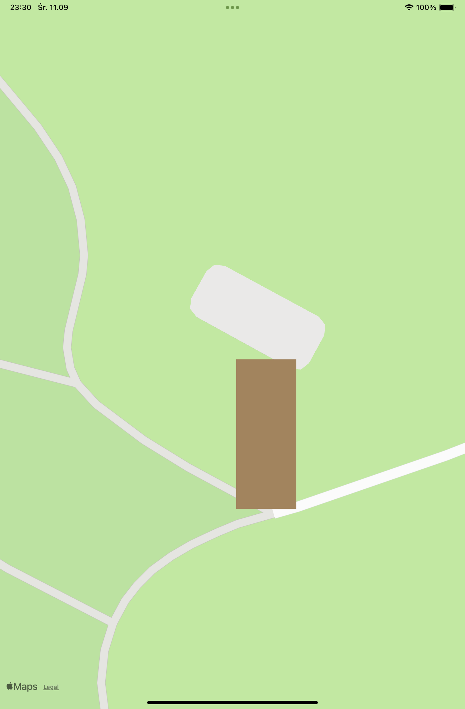

# SwiftUI+MapKit

## Mapy, Style, Nakładki i Kontrolki!


Mapa jest podstawą wielu różnych aplikacji — począwszy od standardowych, po udostępnianie lokalizacji, znajdowanie parkingów, Pokemon Go, i wszystko, co tylko możesz sobie wyobrazić!  
Zanim zaczniesz czytać, powinieneś rozważyć, czy faktycznie zamierzasz korzystać ze SwiftUI! Tylko niektóre, NIE WSZYSTKIE, interfejsy API dostępne w UIKit są dostępne w SwiftUI, i możesz skończyć na tworzeniu wrappera UIViewRepresentable wokół MKMapView, aby osiągnąć to, co chcesz!  
Jeśli Ci to nie przeszkadza, zaczynajmy!

— — — — — — — — — — — — — — — — — —  
W tym artykule skupimy się na tworzeniu Mapy, w tym:
- Ustalaniu granic
- Konfigurowaniu początkowej lokalizacji i powiększenia
- Dodawaniu początkowej zawartości
- Ograniczaniu typów interakcji
- Pozwalaniu na wybór przez użytkownika punktów orientacyjnych

Następnie sprawdzimy różne MapStyles, które możemy zastosować do Mapy, oraz porównamy różnice między różnymi konfiguracjami, takimi jak:
- Hybrydowy
- Imaginary
- Standardowy

Przyjrzymy się także, jak używać WSZYSTKICH adnotacji, nakładek i kontrolek, aby wzbogacić naszą Mapę!

— — — — — — — — — — — — — — — — — —  
Planuję napisać więcej o korzystaniu z MapKit, w tym o łączeniu go z CoreLocation w celu uzyskiwania i śledzenia lokalizacji użytkownika, ustawianiu/śledzeniu lokalizacji mapy w odpowiedzi na interakcje użytkownika i wiele innych! Jeśli jesteś zainteresowany, śledź dalsze aktualizacje!

### Mapa  
Możemy stworzyć Mapę w jednej linii! Tak, dzięki niesamowitej aktualizacji na WWDC23!  
```swift
import SwiftUI  
import MapKit  

struct MapBaseView: View {  
    var body: some View {  
        Map()  
    }  
}  
```



Mapa oddalona, aby pokazać cały kraj? Prawdopodobnie nie jest to coś, czego chcesz w 99.999% przypadków!  
Skonfigurujmy to!

### Początkowa pozycja i początkowe powiększenie  
Na początku ustawmy początkową pozycję i powiększenie naszej mapy! Możemy to osiągnąć, przekazując wartość `initialPosition: MapCameraPosition` podczas konstruowania mapy.  
Istnieje wiele sposobów tworzenia `MapCameraPosition`.  
Na przykład możemy stworzyć jeden z `MapCamera`, struktury definiującej wirtualny punkt widokowy nad powierzchnią mapy, używając `static func camera(MapCamera) -> MapCameraPosition`. Przyjrzyjmy się tej metodzie bliżej, ponieważ będzie nam potrzebna nawet wtedy, gdy tworzymy `MapCameraPosition` za pomocą innych metod, takich jak `static func userLocation(followsHeading: Bool, fallback: MapCameraPosition) -> MapCameraPosition`.

`MapCamera` pozwala nam określić:
- `centerCoordinate`: Lokalizacja kamery na mapie.
- `heading`: Kierunek wskazywany przez kompas, w którym kamera patrzy.
- `pitch`: Nachylenie kamery względem prostopadłości mapy.
- `distance`: Odległość kamery od punktu docelowego, mierzona w metrach. Ustawiając tę wartość, możemy kontrolować, jak mocno chcemy początkowo przybliżyć mapę.

Oto przykład `MapCameraPosition` utworzonego z `camera`, wyśrodkowanego na Nikiszowiec w Katowicach, z odległością 1000 metrów.

```swift
let initialPosition = MapCameraPosition.camera(
    MapCamera(
        centerCoordinate: CLLocationCoordinate2D(latitude: 50.2395, longitude: 19.0741),
        distance: 2000,
        heading: 0,
        pitch: 0
    )
)
```
I skonstruujmy naszą mapę używając tej pozycji:
```swift
Map(initialPosition: initialPosition)
```



Innym sposobem tworzenia `MapCameraPosition`, który może okazać się użyteczny, a o którym już wcześniej wspomniałem, jest `static func userLocation(followsHeading: Bool, fallback: MapCameraPosition) -> MapCameraPosition`. Metoda ta tworzy pozycję kamery wyśrodkowaną na aktualnej lokalizacji użytkownika z określoną pozycją zapasową i opcjonalnie śledzi kierunek użytkownika.

```swift
let userLocation = MapCameraPosition.userLocation(fallback: MapCameraPosition.camera(
    MapCamera(
        centerCoordinate: CLLocationCoordinate2D(latitude: 39.1911, longitude: -106.817535), 
        distance: 1000, 
        heading: 0, 
        pitch: 0)))
```

Pamiętaj, że aby móc z tego korzystać, musisz dodać `Privacy — Location When In Use Usage Description` do `info.plist` i wywołać `CLLocationManager().requestWhenInUseAuthorization`, aby uzyskać zgodę użytkownika.
**PS:** Nie mogłem zmusić aplikacji do wyświetlania lokalizacji użytkownika, jeśli miałem klucz `NSLocationAlwaysAndWhenInUseUsageDescription` i zażądałem uprawnienia do korzystania z lokalizacji zawsze.

### Ustaw granice
Aby zdefiniować opcjonalne granice obszaru, w którym musi pozostawać środek mapy, możemy użyć parametru `bounds: MapCameraBounds`.  
Jest to naprawdę przydatne, na przykład jeśli tworzysz Mapę dla Chorzowskiego Zoo  – oczywiście nie chcesz, aby użytkownicy mogli oddalać mapę lub przesuwać ją poza wyznaczone granice!

Aby utworzyć `MapCameraBounds`, możemy użyć:
```swift
init(centerCoordinateBounds: MKCoordinateRegion, minimumDistance: Double?, maximumDistance: Double?)
```

- **centerCoordinateBounds:** Granica obszaru, w którym musi pozostać środek mapy.
- **minimumDistance:** Minimalna odległość, na jaką można przybliżyć mapę względem jej punktu centralnego, mierzona w metrach.
- **maximumDistance:** Maksymalna odległość, na jaką można oddalić mapę względem jej punktu centralnego, mierzona w metrach.

Dostępne są również inne inicjalizatory, więc wybierz ten, który najlepiej odpowiada Twoim potrzebom!

https://developer.apple.com/documentation/mapkit/mapcamerabounds

Ponownie, używając naszego przykładu z Katowic. Najpierw utworzymy nowy `MKCoordinateRegion` z określonej współrzędnej i wartości odległości. Następnie ustawimy `minimumDistance` i `maximumDistance`, aby ograniczyć poziom powiększenia:

```swift
// Zoo w Chorzowie
    let bounds = MapCameraBounds(
        centerCoordinateBounds: MKCoordinateRegion(
            center: CLLocationCoordinate2D(latitude: 50.2812, longitude: 18.9975),
            latitudinalMeters: 1500,
            longitudinalMeters: 10500
        ),
        minimumDistance: 100,
        maximumDistance: 3000
    )

var body: some View {
    Map(bounds: bounds)
}
```

### Dodaj początkową zawartość
Możemy również utworzyć mapę z istniejącymi markerami i adnotacjami, przekazując zamykający blok kodu (`trailing closure`), opisujący zawartość, którą chcemy dodać.  
Na przykład, marker i adnotacja na szlaku Courthouse Trail:
```swift
var body: some View {
    Map(initialPosition: initialPosition) {

            Annotation("Stadion", coordinate: CLLocationCoordinate2D(latitude: 50.28819, longitude: 18.97358)) {
                Circle()
                    .fill(Color.green.opacity(0.3))
                    .frame(width: 500, height: 400)
            }

            Marker("Słonie", coordinate: CLLocationCoordinate2D(latitude: 50.28199,  longitude: 18.99360))
                .tint(.red)
        }
}
```


Wkrótce omówimy szczegóły dotyczące markerów i adnotacji w dalszej części.

### Ogranicz interakcje użytkownika

Opcjonalnie możemy zdefiniować niestandardowy zestaw `MapInteractionModes`, aby ograniczyć sposoby interakcji użytkowników z mapą za pomocą parametru `interactionModes`.  
Na przykład, aby zezwolić tylko na obracanie i nachylanie, możemy ustawić parametr `interactionModes` na `[.rotate, .pitch]`, jak poniżej:
```swift
Map(initialPosition: initialPosition, interactionModes: [.rotate, .pitch])
```

Pełną listę dostępnych `MapInteractionModes` znajdziesz tutaj:  https://developer.apple.com/documentation/mapkit/mapinteractionmodes

Jeśli nie chcesz, aby użytkownik w ogóle mógł wchodzić w interakcję z mapą, po prostu ustaw kolekcję jako pustą tablicę!


### Włączanie wyboru
Aby umożliwić użytkownikom wybieranie dotykalnych elementów `MapFeature`, możemy przekazać powiązanie `Binding<MapFeature?>`.

```swift
@State private var selection: MapFeature? = nil

var body: some View {
    Map(initialPosition: initialPosition, selection: $selection)
        .onChange(of: selection) { newSelection in
            print(newSelection?.coordinate)
        }
}
```

**Uwaga:** Marker (pinezka), który dodaliśmy samodzielnie, nie jest wybieralny w powyższym przypadku.

Możemy umożliwić wybór niestandardowych markerów i adnotacji, które dodaliśmy, używając `Binding<SelectedValue?>` i dodając tag do naszego Markera lub Adnotacji. Oto szybki przykład:

```swift
@State private var selectedTag: Int?

var body: some View {
    Map(initialPosition: initialPosition, selection: $selectedTag) {

            Marker("Orange", coordinate: CLLocationCoordinate2D(latitude: 50.28199,  longitude: 18.99360))
                .tint(.orange)
                .tag(1)

            Marker("Red", coordinate: CLLocationCoordinate2D(latitude: 50.280944,  longitude: 18.994181))
                .tint(.red)
                .tag(2)

    }
    .mapStyle(.standard(pointsOfInterest: []))
}
```

(Ignoruj `mapStyle` tutaj na razie, przejdziemy do szczegółów za kilka sekund. Ustawiłem go tak, aby markery/adnotacje dla innych elementów `MapFeatures` były ukryte, a nasze markery były łatwo rozpoznawalne).



Ukryłem wszystkie inne elementy, więc trudno to rozpoznać na gifie powyżej. Jednak chciałbym zaznaczyć, że używając `Binding<SelectedValue?>` z niestandardowym tagiem, NIE będziemy mogli wybierać wbudowanych `MapFeatures`!

### Co jeśli chcemy obsługiwać wybór zarówno `MapFeatures`, jak i naszej własnej zawartości?

W tym celu będziemy musieli użyć funkcji Beta wprowadzonej na WWDC24. Zachęcam do zapoznania się z innym z moich artykułów: **SwiftUI+MapKit: Obsługa wyboru użytkownika zarówno dla zdefiniowanych funkcji mapy, jak i naszej własnej zawartości**, aby dowiedzieć się więcej szczegółów!


### Styl mapy

To była dość długa jednolinijkowa instrukcja, ale teraz możemy przejść do kolejnej kluczowej części MapKit, czyli stylu mapy (`MapStyle`), który możemy zastosować do naszej mapy! Istnieją trzy różne style, a dla każdego z nich mamy zestaw parametrów, które możemy zdefiniować dla dalszej personalizacji.

#### Imagery
`Imagery` to styl mapy, który reprezentuje zdjęcie satelitarne obszaru, który wyświetla mapa. Ustawiając parametr `elevation`, możemy kontrolować, jak mapa renderuje wzniesienia:
- **automatic:** Domyślny styl wzniesień, renderujący płaską, 2D mapę.
- **flat:** Wartość, która renderuje płaską, 2D mapę.
- **realistic:** Wartość, która renderuje realistyczną, 3D mapę.

```swift
Map(initialPosition: initialPosition)
    .mapStyle(.imagery(elevation: .realistic))
```


#### Hybrid

Styl `hybrid` można uznać za rozszerzenie stylu `imagery`, gdzie oprócz obrazu satelitarnego obszaru mamy również ścieżki dróg z ich nazwami nałożonymi na mapę. Oprócz `elevation`, możemy również ustawić:
- **pointsOfInterest:** Kolekcja `PointOfInterestCategories`, które mapa wyświetla.
- **showsTraffic:** Wartość logiczna wskazująca, czy mapa wyświetla ruch drogowy.

Na przykład, aby wyświetlać tylko parki i parkingi:
```swift
Map(initialPosition: initialPosition)
    .mapStyle(.hybrid(elevation: .realistic, pointsOfInterest: [.park, .parking], showsTraffic: true))
```

#### Standard
Jak sama nazwa wskazuje, jest to styl mapy, który reprezentuje domyślną prezentację mapy — mapę uliczną, która pokazuje pozycje wszystkich dróg i niektórych nazw dróg, w zależności od poziomu powiększenia mapy. Przy tworzeniu stylu `standard`, tak jak w przypadku stylu `hybrid`, możemy skonfigurować:
- **elevation:** Jedna z wartości `MapStyle.Elevation` określająca, czy framework renderuje wzniesienia mapy.
- **pointsOfInterest:** Kolekcja `PointOfInterestCategories`, które mapa wyświetla.
- **showsTraffic:** Wartość logiczna wskazująca, czy mapa wyświetla ruch drogowy.
  

Dodatkowo możemy również skonfigurować `emphasis`, aby kontrolować, jak framework wyróżnia elementy mapy:
```swift
Map(initialPosition: initialPosition)
    .mapStyle(.standard(emphasis: .muted))
```



### Adnotacje i nakładki

Podczas ustawiania początkowej zawartości mapy użyliśmy już niektórych funkcji, ale przyjrzyjmy się bliżej wszystkim ciekawym elementom, które możemy dodać do mapy! Oto typy `MapContent`, które możemy dodać do `MapContentBuilder`:
- **Annotation**
- **UserAnnotation**
- **Marker**
- **MapCircle**
- **MapPolygon**
- **MapPolyline**

#### Przykłady
Oto kilka przykładów:

##### Annotation, Marker, MapCircle

```swift
var body: some View {
    Map(initialPosition: .camera(MapCamera(
        centerCoordinate: CLLocationCoordinate2D(latitude: 50.280944,  longitude: 18.994181),
        distance: 1000,
        heading: 0,
        pitch: 0
    ))) {
            Annotation("Annotation", coordinate: CLLocationCoordinate2D(latitude: 50.28199,  longitude: 18.99360)) {
                Image(systemName: "flag")
                    .padding(.all, 8)
                    .background(RoundedRectangle(cornerRadius: 5).fill(.yellow))
            }

            Marker("Marker", coordinate: CLLocationCoordinate2D(latitude: 50.280944,  longitude: 18.994181))
                .tint(.red)

            MapCircle(center: CLLocationCoordinate2D(latitude: 50.280944,  longitude: 18.994181), radius: 100)
                .foregroundStyle(.red.opacity(0.2))
    }
    .mapStyle(.standard(pointsOfInterest: []))
    .onAppear {
        print(CLLocationManager().authorizationStatus.rawValue)
    }
}
```



##### MapPolygon

```swift
MapPolygon(coordinates: [
                CLLocationCoordinate2D(latitude: 50.280950, longitude: 18.994275),
                CLLocationCoordinate2D(latitude: 50.280800, longitude: 18.994275),
                CLLocationCoordinate2D(latitude: 50.280800, longitude: 18.994181),
                CLLocationCoordinate2D(latitude: 50.280950, longitude: 18.994181)
])
.foregroundStyle(.brown)
```




##### MapPolyline

```swift
MapPolyline(coordinates: [
                CLLocationCoordinate2D(latitude: 50.280950, longitude: 18.994275),
                CLLocationCoordinate2D(latitude: 50.280800, longitude: 18.994275),
                CLLocationCoordinate2D(latitude: 50.280800, longitude: 18.994181),
                CLLocationCoordinate2D(latitude: 50.280950, longitude: 18.994181)
])
.stroke(.blue, lineWidth: 8)
```

##### UserAnnotation
```swift
let initialPosition = MapCameraPosition.userLocation(
    fallback: .camera(MapCamera(
        centerCoordinate: CLLocationCoordinate2D(latitude:  50.280944,  longitude: 18.994181),
        distance: 1000,
        heading: 0,
        pitch: 0
    ))
)

var body: some View {
    Map(initialPosition: initialPosition) {
        UserAnnotation(anchor: .center, content: { location in
            Text("UserAnnotation")
                .padding(.all, 8)
                .background(RoundedRectangle(cornerRadius: 5).fill(.yellow))
        })
    }
    .mapStyle(.standard(pointsOfInterest: []))
}
```

**Uwaga:** Aby użyć `UserAnnotation`, musimy dodać `Privacy — Location When In Use Usage Description` do `info.plist` i wywołać `CLLocationManager().requestWhenInUseAuthorization`, aby uzyskać zgodę użytkownika. Preferuję jednak używanie `CoreLocation` do pobierania bieżącej lokalizacji i dodawania własnej adnotacji, ponieważ `UserAnnotation` może zniknąć, jeśli użytkownik porusza się po mapie, a jego lokalizacja się zmienia.

### Kontrolki mapy
Na zakończenie dnia przyjrzyjmy się kontrolkom, które możemy dodać, aby umożliwić użytkownikom interakcję z mapą, np. zmianę skali mapy, wyświetlanie lub ukrywanie bieżącej lokalizacji urządzenia itp. Oto dostępne kontrolki:
- **MapCompass**
- **MapPitchToggle**
- **MapPitchSlider** (tylko dla macOS)
- **MapScaleView**
- **MapUserLocationButton**
- **MapZoomStepper** (tylko dla macOS)

#### MapCompass
Dwa sposoby użycia kontrolki `MapCompass`.

Pierwszy, jako osobny widok:
```swift
@Namespace var mapScope

var body: some View {
    ZStack {
        Map(initialPosition: initialPosition, scope: mapScope)
            .mapStyle(.standard(pointsOfInterest: []))
        MapCompass(scope: mapScope)
    }
    .mapScope(mapScope)
}
```
**Uwaga:** Musimy określić parametr `scope`, aby poinformować framework, że `Map` i `MapCompass` należą do tej samej przestrzeni nazw!

Drugi sposób, z użyciem modyfikatora `mapControls(_:)`:
```swift
Map(initialPosition: initialPosition)
    .mapControls {
        MapCompass()
    }
```

#### MapPitchToggle
Ta kontrolka pozwala ustawić nachylenie mapy, przełączając się między widokami 2D i 3D:
```swift
Map(initialPosition: initialPosition)
    .mapControls {
        MapPitchToggle()
    }
    .mapStyle(.standard(pointsOfInterest: []))
```

#### MapScaleView
Wyświetla legendę z informacjami o odległości w lewym górnym rogu:
```swift
Map(initialPosition: initialPosition)
    .mapControls {
        MapScaleView()
    }
```

**Uwaga:** Ten widok jest widoczny tylko podczas skalowania.

#### MapUserLocationButton
Przycisk, który ustawia ramkę mapy na lokalizacji użytkownika:
```swift
.mapControls {
    MapUserLocationButton()
}
```

**Powtórzenie:** Musimy dodać `Privacy — Location When In Use Usage Description` do `info.plist` i wywołać `CLLocationManager().requestWhenInUseAuthorization`, aby uzyskać zgodę użytkownika!


## Wsparcie dla jednoczesnego wybierania zarówno predefiniowanych funkcji mapy, jak i naszej własnej zawartości.

**UWAGA od IOS18 !!!**

Nie mogę uwierzyć, że nie mogliśmy obsługiwać wyboru zarówno dla predefiniowanych funkcji mapy, jak i dla naszej własnej zawartości aż do tegorocznej WWDC! (Na wszelki wypadek, czy możemy? Przynajmniej ja żyję w 2024 roku, pisząc to!).  
W poprzednim artykule, **Mapy, Style, Nakładki i Kontrolki!**, przedstawiłem, jak możemy obsługiwać wybór na dotykalnej funkcji mapy za pomocą `selection: Binding<MapFeature?>`, jak poniżej:

```swift
@State private var selection: MapFeature? = nil

var body: some View {
    Map(initialPosition: initialPosition, selection: $selection)
}
```

Albo obsługiwać wybór dla dodanej niestandardowej zawartości używając `Binding<SelectedValue?>`.
```swift
@State private var selectedTag: Int?

var body: some View {
    Map(initialPosition: initialPosition, selection: $selectedTag) {
            Marker("Orange", coordinate: CLLocationCoordinate2D(latitude: 50.28199,  longitude: 18.99360))
                .tint(.orange)
                .tag(1)

            Marker("Red", coordinate: CLLocationCoordinate2D(latitude: 50.280944,  longitude: 18.994181))
                .tint(.red)
                .tag(2)

    }
    .mapStyle(.standard(pointsOfInterest: []))
}
```

Jednak, jak wspomniałem w moim poprzednim artykule, żadne z powyższych podejść nie umożliwia wyboru zarówno dla predefiniowanych funkcji mapy, jak i dla naszej własnej zawartości. Aby obsłużyć oba, musimy użyć nowych funkcji beta wprowadzonych na WWDC24!  
Zobaczmy, jak to działa!

### Obsługa obydwu za pomocą Map Selection

Kluczem jest użycie struktury `MapSelection`. **Uwaga: jest to nadal funkcja, dostępna tylko dla iOS 18.0+.  **
`MapSelection` to wartość reprezentująca wybraną funkcję na mapie, która może być zainicjowana z `MapFeature` lub `SelectionValue: Hashable`. To dokładnie to, czego potrzebujemy!

Oto jak możemy to wykorzystać:

```swift
import SwiftUI
import MapKit

private struct DemoView: View {
    static let zoo = MapCameraPosition.camera(MapCamera(
        centerCoordinate: CLLocationCoordinate2D(latitude: 50.28199,  longitude: 18.99360),
        distance: 1000,
        heading: 0,
        pitch: 0
    ))
    
    @State private var position: MapCameraPosition = Self.zoo
    @State private var selection: MapSelection<Int>?

    var body: some View {
        Map(position: $position, selection: $selection) {

            Marker("Orange", coordinate: CLLocationCoordinate2D(latitude: 50.28199,  longitude: 18.99360))
                .tint(.orange)
                .tag(1)

            Marker("Red", coordinate: CLLocationCoordinate2D(latitude: 50.280944,  longitude: 18.994181))
                .tint(.red)
                .tag(2)
        }
    }
}
```

### Co tutaj zrobiliśmy?

1. **Zmienna stanu `selection: MapSelection<Int>?`:** Ważne jest, aby nie używać tutaj `MapFeature`, aby adnotacje/markery, które sami zdefiniowaliśmy, mogły być również wybieralne.
2. **Tagowanie markerów:** Zamiast zwykłej liczby całkowitej (`Int`), opakowujemy ją w `MapSelection`.

### Podsumowanie
Trzymając się powyższych wytycznych, możemy teraz obsługiwać wybór zarówno dla naszej własnej zawartości, jak i dla funkcji mapy, które znajdują się na samej mapie.

## Ustawianie i Śledzenie Pozycji Mapy

Kiedy pracujemy z mapą, możliwość przełączania się między różnymi pozycjami, na przykład w odpowiedzi na wyszukiwania użytkownika w różnych lokalizacjach, to bardzo często potrzebna funkcja. Inną, którą możemy chcieć, jest śledzenie pozycji mapy, gdy użytkownik ją przesuwa.  
Możesz pomyśleć, że wystarczy przekazać `position: Binding<MapCameraPosition>` podczas inicjalizacji mapy i odczytać `position`, aby pobrać pozycję mapy. Nie do końca!  
Sprawdźmy to!

### Konfiguracja
Prosta mapa z początkową pozycją wyśrodkowaną na Planetarium w Chorzowie:

```swift
import SwiftUI
import MapKit

private struct DemoView: View {
    //50.290625, 18.991975
    static let planetary = MapCameraPosition.camera(MapCamera(
        centerCoordinate: CLLocationCoordinate2D(latitude: 50.290625, longitude: 18.991975),
        distance: 1000,
        heading: 0,
        pitch: 0
    ))

    //50.296196, 18.767794
    static let stadium = MapCameraPosition.camera(MapCamera(
        centerCoordinate: CLLocationCoordinate2D(latitude: 50.296196, longitude: 18.767794),
        distance: 1000,
        heading: 0,
        pitch: 0
    ))
       
    @State private var position: MapCameraPosition = Self.planetary

    var body: some View {
        Map(position: $position)
    }
}
```

Szybko uruchommy aplikację, aby upewnić się, że jesteśmy na tej samej stronie!

### Ustawianie pozycji
Ustawienie pozycji jest proste.  
Tak jak się spodziewasz, wystarczy, że ustawimy zmienną stanu `position` na nową wartość.

```swift
Map(position: $position)
    .overlay(alignment: .top, content: {
                HStack(spacing: 16) {
                    Button(action: {
                        position = Self.planetary
                    }, label: {
                        Text("Planetarium")
                            .font(.title3)
                            .foregroundStyle(.white)
                            .padding(.vertical, 4)
                            .padding(.horizontal, 8)
                            .frame(maxWidth: .infinity)
                            .background(RoundedRectangle(cornerRadius: 4).fill(.gray))
                    })

                    Button(action: {
                        position = Self.stadium
                    }, label: {
                        Text("Górnik Zabrze")
                            .font(.title3)
                            .foregroundStyle(.white)
                            .padding(.vertical, 4)
                            .padding(.horizontal, 8)
                            .frame(maxWidth: .infinity)
                            .background(RoundedRectangle(cornerRadius: 4).fill(.gray))
                    })
                }
                .fixedSize(horizontal: true, vertical: false)
                .padding(.all, 16)
            })
```

I gotowe! Możemy teraz przeskakiwać między Katowicami a Zabrzem!

### Śledzenie zmiany pozycji mapy
Możesz pomyśleć, że aby śledzić pozycję mapy, wystarczy pobrać `position.region` przy zmianie pozycji.  
Niestety, nie! Jeśli spróbujemy wydrukować pozycję, zauważymy, że wszystkie wartości są `nil`… (z wyjątkiem momentu, gdy ją inicjalizujemy!)

- `position.rect: nil`
- `position.positionedByUser: true`
- `position.region: nil`
- `position.item: nil`
- `position.camera: nil`

Aby śledzić zmiany pozycji mapy, musimy użyć modyfikatora widoku `onMapCameraChange(frequency:_)`, który informuje nas, kiedy zmienia się pozycja — natychmiastowo (przy ustawieniu `continuous` dla `frequency`) lub po zakończeniu ruchu (`onEnd` dla `frequency`).

Nie musisz używać powiązania (`binding`), aby być powiadamianym przez `onMapCameraChange`. Zobaczmy, jak to działa, dodając nakładkę pokazującą bieżącą pozycję mapy.

```swift
private struct DemoView: View {
    // ...
    
    @State private var centerCoordinate: CLLocationCoordinate2D? = Self.planetary.camera?.centerCoordinate

    var body: some View {
        Map(position: $position)
            .onMapCameraChange(frequency: .continuous) { context in
                self.centerCoordinate = context.region.center
            }
            .overlay(alignment: .bottomLeading, content: {
                if let centerCoordinate = centerCoordinate {
                    Text("\(centerCoordinate.latitude), \(centerCoordinate.longitude)")
                        .font(.title3)
                        .foregroundStyle(.white)
                        .padding(.vertical, 4)
                        .padding(.horizontal, 8)
                        .background(RoundedRectangle(cornerRadius: 4).fill(.gray))
                        .padding(.all, 16)
                }
            })
            // ...
    }
}
```


Jak widać, współrzędne w lewym dolnym rogu aktualizują się, gdy przesuwamy mapę!

## Konwersja współrzędnych ekranu na rzeczywistą lokalizację geograficzną

#### W jakich scenariuszach możemy chcieć przekonwertować współrzędne ekranu na rzeczywistą lokalizację geograficzną na mapie?

Na przykład możemy chcieć, aby użytkownik mógł wybrać dowolną lokalizację na mapie i stworzyć tam nowy marker, reprezentujący jego ulubione miejsce! Dzięki `MapReader` i `MapProxy`, możemy to zrobić w kilku linijkach kodu!


Wszystko, co musimy zrobić, to opakować naszą mapę w `MapReader` i użyć obiektu `MapProxy`, który umożliwia konwersję lokalizacji ekranu na lokalizacje mapy i odwrotnie.  
Możesz również użyć tego proxy do konwersji między `MapCamera` a `MKMapRect` lub `MKCoordinateRegion`, ale to zostawimy na później!

Zobaczmy przykład, w którym wyświetlimy marker w miejscu, na które użytkownik kliknie.

```swift
import SwiftUI
import MapKit

private struct DemoView: View {
    static let stadium = MapCameraPosition.camera(MapCamera(
        centerCoordinate: CLLocationCoordinate2D(latitude: 50.296196, longitude: 18.767794),
        distance: 1000,
        heading: 0,
        pitch: 0
    ))
    
    @State private var position: MapCameraPosition = Self.stadium
    @State private var userTapLocation: CLLocationCoordinate2D?

    var body: some View {
        MapReader { proxy in
            Map(position: $position) {
                if let userTapLocation = userTapLocation {
                    Marker("tapped!", coordinate: userTapLocation)
                        .tint(.orange)
                }
            }
            .onTapGesture { position in
                if let coordinate = proxy.convert(position, from: .local) {
                    self.userTapLocation = coordinate
                }
            }
        }
    }
}
```


I to wszystko!

## Podniesienie aplikacji Mapy na wyższy poziom przy użyciu MKLocalSearch

Nie można naprawdę wyobrazić sobie aplikacji mapowej bez funkcji wyszukiwania!

Dzięki MKLocalSearch możemy przeprowadzić dwa rodzaje wyszukiwań:


​	1.	Wyszukiwanie oparte na słowach kluczowych (zapytanie w języku naturalnym).

​	2.	Wyszukiwanie, określając kategorie punktów zainteresowania (to także sposób, w jaki możesz uzyskać wszystkie MKMapItem dostępne w regionie!).

Każde podejście ma swoje zastosowania, które omówimy w tym artykule!

Na końcu znajdziesz pełny kod użyty w tym artykule. Możesz go skopiować i wkleić do swojego projektu, aby samemu przetestować podczas czytania!


**Konfiguracja**


Zacznijmy od dodania prostego kodu startowego:

```swift
private struct DemoView: View {
    static let stadium = MapCameraPosition.camera(MapCamera(
        centerCoordinate: CLLocationCoordinate2D(latitude: 50.296196, longitude: 18.767794),
        distance: 1000,
        heading: 0,
        pitch: 0
    ))
    
    @State private var position: MapCameraPosition = Self.stadium
    @State private var region: MKCoordinateRegion? = Self.stadium.region
    @State private var selection: MapSelection<Int>?
    @State private var searchResultItems: [MKMapItem] = []

    var body: some View {
        Map(position: $position, selection: $selection) {
            ForEach(searchResultItems, id: \.self) { item in
                Marker(item: item)
            }
        }
        .onMapCameraChange { context in
            self.region = context.region
        }
    }
}
```

